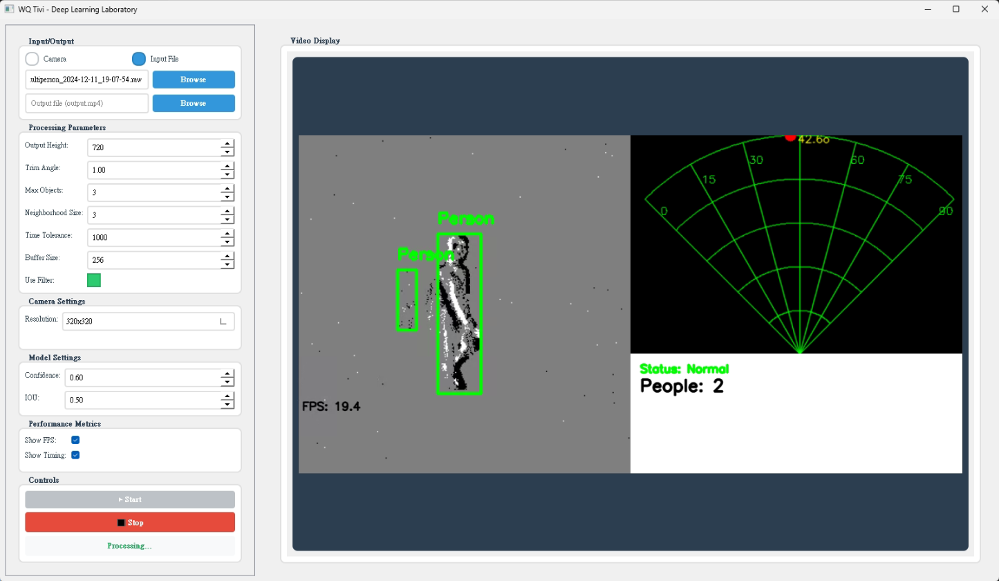
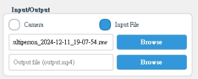
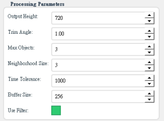
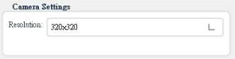
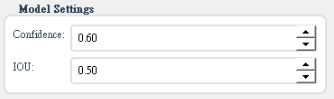
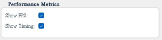
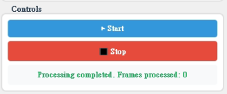
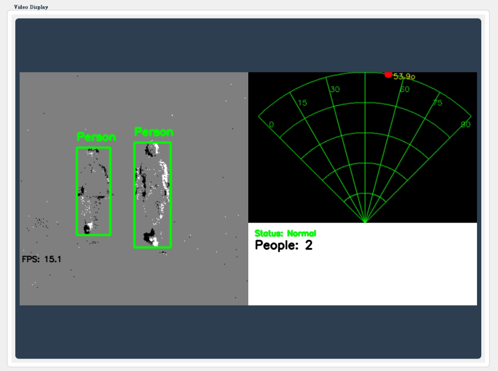

# Event-based Visual System (EVS)

A high-performance event-based visual processing system that combines event camera data with radar-like visualization for real-time object tracking and monitoring.

## Key Features

- Real-time event processing with GPU acceleration (CUDA via CuPy)
- Radar-style visualization of detected objects
- Multiple object tracking with smooth trajectory prediction
- Fall detection using deep learning
- Configurable filtering and noise reduction
- Support for both filtered and unfiltered event processing modes
- FPS limiting for resource optimization
- Comprehensive visualization with angle and distance measurements
- Advanced peak detection and tracking algorithms
- Hungarian algorithm-based object matching
- Spring-mass-damper motion model for smooth trajectory prediction
- Adaptive noise filtering with spatial and temporal constraints
- Live visualization with configurable display options

## User Interface

The EVS system provides an intuitive graphical user interface with the following features:

- **Main Dashboard**: Real-time display of event camera feed and radar visualization
- **Configuration Panel**: Adjust system parameters directly from the interface
- **Multiple Display Modes**:
  - Full radar mode
  - Object tracking mode
  - Event analysis mode
  - Combined mode
- **Analysis Tools**: Charts and statistics on tracked events and objects
- **Data Export Options**: Save analysis results and images to common formats
- **Theme Customization**: Support for light/dark modes and color customization
- **Processing Controls**: Start, stop, and configure processing in real-time
- **Input/Output Management**: Select between camera or file input, and configure output recording
- **Camera Settings**: Adjust resolution and camera parameters
- **Performance Metrics**: Monitor FPS and processing times


*The main EVS interface showing event visualization and radar tracking*

## System Requirements

- Python 3.7+ (Python 3.9 recommended)
- CUDA-compatible GPU
- Dependencies:
  - cupy-cuda12x==13.3.0
  - numpy==1.23.5
  - opencv-python==4.10.0.84
  - opencv-contrib-python==4.10.0.84
  - scipy==1.15.0
  - metavision_core
  - PyQt5==5.15.9 (for user interface)
  - pyqtgraph==0.13.3 (for charts)

## Installation

### Step-by-Step Setup for Python 3.9 and CUDA 12.1

1. **Install Python 3.9**:
   - Download and install Python 3.9 from the [official Python website](https://www.python.org/downloads/).
   - Ensure that Python 3.9 is added to your system's PATH.

2. **Install CUDA Toolkit 12.1**:
   - Download and install the CUDA Toolkit 12.1 from the [NVIDIA website](https://developer.nvidia.com/cuda-toolkit).
   - Follow the installation instructions specific to your operating system.

3. **Install cuDNN >= 8.9.2**:
   - Download and install cuDNN from the [NVIDIA website](https://developer.nvidia.com/cudnn).
   - Follow the installation instructions specific to your operating system.

4. **Install Metavision >= 4.6**:
   - Download and install from the [Metavision website](https://docs.prophesee.ai/stable/index.html).
   - Follow the installation instructions specific to your operating system.

5. **Set up a Virtual Environment**:
   - Open a terminal or command prompt.
   - Navigate to your project directory.
   - Create a virtual environment:
     ```bash
     python3.9 -m venv evs_env
     ```
   - Activate the virtual environment:
     - On Windows:
       ```bash
       evs_env\Scripts\activate
       ```
     - On macOS/Linux:
       ```bash
       source evs_env/bin/activate
       ```

6. **Install Python Dependencies**:
   - Ensure your virtual environment is activated.
   - Install the required packages using the `requirements.txt` file:
     ```bash
     pip install -r requirements.txt
     ```

7. **Verify Installation**:
   - Check that all dependencies are installed correctly:
     ```bash
     python -m pip list
     ```
   - Ensure that `cupy-cuda12x`, `numpy`, `opencv-python`, `opencv-contrib-python`, `scipy`, `PyQt5`, and `pyqtgraph` are listed.

## Usage

### GUI Application

Start the application with the graphical user interface:

```bash
python main.py
```

## User Interface Guide

### Main Components

1. **Input/Output Section**:
   - Switch between camera mode and file input mode
   - Select input event files (.raw, .dat)
   - Configure output video recording path
   
   

   *Input/Output configuration panel*

2. **Processing Parameters**:
   - Adjust output resolution
   - Configure noise filtering parameters
   - Set object detection thresholds
   - Tune tracking parameters
   
   

   *Processing parameters configuration*

3. **Camera Settings**:
   - Select resolution from preset options
   - Adjust camera biases for event camera
   
   

   *Camera resolution and settings panel*

4. **Model Settings** (Admin mode):
   - Configure object detection confidence thresholds
   - Adjust IOU thresholds for tracking
   
   

   *Advanced model configuration (admin mode)*

5. **Performance Metrics** (Admin mode):
   - Toggle FPS display
   - Enable processing time breakdown
   
   

   *Performance monitoring options*

6. **Controls**:
   - Start processing button
   - Stop processing button
   - Current status indicator
   
   

   *Processing control panel*

7. **Video Display**:
   - Main visualization area showing:
     - Event camera feed
     - Radar-style visualization
     - Detection results
     - Status information
   
   
   
   *Main visualization area showing combined event and radar display*

### Using the Interface

1. **Setup Input Source**:
   - Select between camera or file input
   - If using file input, select the .raw file

2. **Configure Output** (optional):
   - Set output path for recording results

3. **Adjust Settings**:
   - Select camera resolution
   - Adjust processing parameters as needed

4. **Start Processing**:
   - Click the Start button to begin processing
   - The display will show the combined visualization

5. **Monitor Results**:
   - View people count and fall detection status
   - Check radar visualization for movement direction
   - Monitor performance metrics if enabled

6. **Stop Processing**:
   - Click the Stop button when finished
   - If recording, the output file will be saved

## Performance Optimization

The system is optimized for performance through:
1. GPU acceleration for event processing
2. Multi-threaded operations for parallel processing
3. Efficient memory management with CuPy
4. Optimized visualization routines
5. Configurable FPS limiting
6. Batch processing of events
7. Dynamic buffer management
8. Adaptive filtering thresholds
9. Efficient UI rendering with PyQt5

## System Architecture

The system consists of several key components:

- `main.py`: Core execution and coordination
- `src/application/services/main_service.py`: Main logic factory and service coordination
- `src/core/radar.py`: Radar visualization and object tracking
- `src/core/filters.py`: Event filtering and noise reduction algorithms
- `src/infrastructure/ml_models/`: Deep learning models for object detection and fall detection
- `src/infrastructure/event_camera/`: Event camera interfaces and processing
- `src/interface/gui/`: Graphical user interface components
- `src/domain/`: Domain entities, value objects, and business logic

### Key Features Implementation

- **Event Processing**: GPU-accelerated event processing with CuPy
- **Object Tracking**: Hungarian algorithm with dynamic gating thresholds
- **Motion Model**: Spring-mass-damper system for trajectory prediction
- **Visualization**: Combined event and radar display with real-time metrics
- **Fall Detection**: Deep learning-based fall detection models
- **User Interface**: PyQt5-based interface with real-time visualization

## Contributing

We welcome contributions from the computer vision and event camera community! The EVS system is designed to be extensible and modular, making it ideal for collaborative development.

### How to Contribute

1. **Fork the Repository**
   - Create your own fork of the project on GitHub
   - Keep your fork in sync with the main repository

2. **Set Up Your Development Environment**
   - Follow the installation instructions above
   - Make sure all tests pass on your local setup

3. **Choose an Issue or Feature**
   - Check out the open issues or suggest a new feature
   - Comment on an issue to let others know you're working on it

4. **Create a Feature Branch**
   - Always branch from the latest `main` branch
   - Use a descriptive name: `feature/radar-visualization` or `fix/memory-leak`

5. **Write Quality Code**
   - Follow the project's coding standards
   - Add appropriate comments and documentation
   - Write tests for new functionality
   - Ensure your code works with different cameras and input sources

6. **Submit a Pull Request**
   - Provide a clear description of your changes
   - Reference any related issues
   - Be responsive to feedback and review comments

### Code of Conduct

- Be respectful and inclusive in your communication
- Constructive criticism is welcome, but always be kind
- Focus on what's best for the community and the project

### Development Focus Areas

We're particularly interested in contributions in these areas:

- Performance optimizations for real-time processing
- Support for additional event camera models
- Enhanced visualization techniques
- New tracking algorithms
- Machine learning integration for advanced object detection
- UI/UX improvements
- Documentation and tutorials

Join us in advancing event-based vision technology!

## License

This project is licensed under the MIT License - a permissive license that allows you to freely use, modify, distribute, and sell your own products based on this codebase.

### MIT License Summary

- ✅ Commercial use
- ✅ Modification
- ✅ Distribution
- ✅ Private use
- ✅ Sublicensing
- ⚠️ No liability or warranty

### Proper Attribution

If you use this codebase in your own projects, please provide appropriate attribution:

```
Event-based Visual System (EVS)
Copyright (c) 2025 Deep Learning Laboratory - Nguyen Ngoc Thien
https://github.com/ngocthien2306/evs-proj
```

We believe in open source and the power of community-driven development. Your contributions help make this technology accessible to everyone, advancing the field of event-based vision.

See the [LICENSE](LICENSE) file for the full text of the MIT License.